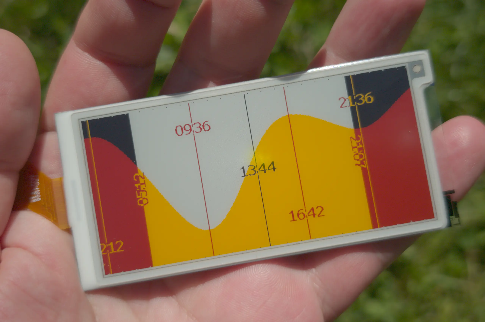

# inksurf

A paper-display tide clock for the Salish Sea.



## What's on screen

24-hour tide curve centered on right-now, plus the day's celestial scaffolding, all rendered to a 384×180 BWRY e-ink display.

- **Tide curve** — yellow below the waterline, white above (in daytime columns). Fixed HAT/LAT vertical scale (`-4.6 ft` to `+14.1 ft` MLLW) so curve heights are directly comparable day to day.
- **Now line** — vertical black bar thru panel center with current time as text. Per-pixel inverted from background so it stays legible across the day/night seam.
- **High / low markers** — red vertical lines with `HH:MM` times; high-tide labels sit below the curve (bottom third), low-tide labels above (top third).
- **Sunrise / sunset labels** — `HH:MM` rendered vertically at the day/night seam columns, glyphs rotated 90° (CCW at sunrise so you read it bottom-up, CW at sunset so you read it top-down).
- **Hourly ticks** — 1-px marks on the top and bottom edges. Local midnight gets a 2-px-tall tick to anchor the calendar boundary.
- **Day/night colorscheme** — pixels in columns where the sun is below the horizon are inverted as a final pass: `WHITE ↔ BLACK`, `RED ↔ YELLOW`. The seam is a sharp visual transition right where sunrise and sunset happen.
- **Moon cycle indicator** — 2-pixel diagonal arrow on the left edge that traces a sine wave over the 29.5-day synodic month. Rising arrow when waxing, falling arrow when waning. Within 12 h of new or full, the arrow becomes a 2-px horizontal line at the very bottom (new moon) or top (full moon).
- **Solar year indicator** — same treatment on the right edge over the 365.25-day cycle. Winter solstice at the bottom, summer at the top, 2-px horizontal marker when within 12 h of either solstice.
- **Solar-midnight deep clean** *(optional, off by default)* — when enabled, once per night at solar midnight (midpoint between yesterday's sunset and today's sunrise; DST-immune by construction) the daemon cycles the panel thru `K → Y → R → W` to exercise every ink particle and clear ghosting. Normal operation already moves every pixel daily, so it's not needed in practice — see [How it works](#how-it-works).

## Hardware

- **Panel**: [Adafruit 6414](https://www.adafruit.com/product/6414) — 3.52" BWRY e-paper, JD79667 driver. Adafruit advertises 340×180, but the full active grid is 384×180 — inksurf addresses all of it.
- **Carrier**: an FPC adapter wired to a Waveshare RP2040-Zero (or equivalent). Pin assignments: `CS=GP19`, `DC=GP18`, `RST=GP17`, `BUSY=GP16`, `SCK=GP22`, `MOSI=GP23`. User LED on `GP13`.
- **Flippy ribbon** — the bottom-contact FPC on the 6414 needs Adafruit's included "extender" cable (or you fold the cable yourself).
- **Host**: any always-on Linux box with a free USB port. A Raspberry Pi covers it with room to spare.

## Repo layout

Three Rust crates in one repo, one umbrella:

- [`src/`](src/) — embedded firmware for the RP2040. Driver modules for **SSD1680** (Adafruit 6383, 6392 grayscale panels) and **JD79667** (Adafruit 6414 BWRY). Unified binary; the host picks the active panel at boot via `M` + panel-id byte.
- [`host/`](host/) — `eink-host` CLI for ad-hoc interaction: send raw frames, drive multi-pass grayscale renders against the SSD1680 panels, fire BWRY images at the JD79667.
- [`tide-display/`](tide-display/) — the inksurf daemon. Fetches NOAA CO-OPS predictions, renders the display, and pushes it to the panel every few minutes (a random 7–9 min in the classic decimal edition; aligned to `HH:X5` in the dozenal edition — see [How it works](#how-it-works)).

## Quickstart

Put the RP2040 in BOOTSEL (hold BOOT, tap RESET, release BOOT) and flash the unified firmware:

```sh
cargo run --release
```

Then run the daemon:

```sh
cargo run --manifest-path tide-display/Cargo.toml \
          --target x86_64-unknown-linux-gnu --release
```

It prints status to stderr and writes a debug PPM to `/tmp/tide-render.ppm` every cycle.

### As a service

`deploy/install.sh` builds the release binary, installs it to `/usr/local/bin/inksurf`, drops the systemd unit, and enables it:

```sh
deploy/install.sh
```

Re-run it after every release build — the binary is installed (not run in place) so SELinux-enforcing hosts can exec it (files under an arbitrary `/mnt` mount get an `unlabeled_t` context the service domain may refuse; `/usr/local/bin` is properly labeled `bin_t`). The unit template lives at [`deploy/inksurf.service`](deploy/inksurf.service); edit `User=` and the `INKSURF_DOZENAL` line there before installing.

Don't forget the udev rule (next section) so ModemManager doesn't poke the panel's USB port.

## Configuration

Today the daemon is hard-coded for **Bremerton WA** tides (NOAA station 9445958) and **Southworth WA** sunrise/sunset (47.5126°N 122.5054°W). To retarget it:

1. Edit `tide-display/src/main.rs` and change `STATION_ID`, `SUN_LAT`, `SUN_LON`.
2. Replace `TIDE_MIN_FT` / `TIDE_MAX_FT` with your station's HAT/LAT bounds in MLLW. Fetch from `https://api.tidesandcurrents.noaa.gov/mdapi/prod/webapi/stations/<STATION>/datums.json` and convert from NAVD88 by subtracting the station's MLLW→NAVD88 offset.

The udev rule does two things: gives the panel a stable `/dev/inksurf` symlink (the daemon and `eink-host` default to it, so it doesn't matter whether the kernel enumerates the board as `ttyACM0`, `ttyACM1`, … — that ordering changes across reboots) and sets `ID_MM_DEVICE_IGNORE` so ModemManager doesn't probe the CDC port with AT commands (Fedora and most desktop Linuxes need this). Install [`deploy/99-inksurf.rules`](deploy/99-inksurf.rules):

```sh
sudo cp deploy/99-inksurf.rules /etc/udev/rules.d/
sudo udevadm control --reload && sudo udevadm trigger
```

Then unplug / replug the panel and confirm `/dev/inksurf` exists.

## How it works

**Day-style first, invert pass second.** The renderer paints the whole 24-hour chart in a single "day mode" color scheme (white above curve, yellow below, black marker text). Then a single final pass walks every column, checks whether the sun is below the horizon at that column's time, and inverts only those columns: `BLACK ↔ WHITE`, `RED ↔ YELLOW`. The whole night theme falls out of one cheap post-processing step, and you get a sharp seam exactly at sunrise and sunset for free.

**Vertical sunrise/sunset labels** sit on top of those seams. They use per-pixel invert, so half a label can sit in a day column (one color) and half in a night column (the opposite), without a readability cliff at the transition.

**Bitmap font, hand-drawn.** A small set of digit + colon PNGs in [`assets/font/`](assets/font/) carry the typography. Decoded at compile time via `include_bytes!`; the font cache is a `OnceLock`. No proportional-spacing tricks — each glyph is a hand-tuned variable-width bitmap.

**Deep clean (optional, off by default).** Set `INKSURF_DEEP_CLEAN=1` and once per night the daemon cycles `K → Y → R → W` (~4 minutes) to exercise all four ink particles. The trigger is event-based: solar midnight (the midpoint between yesterday's sunset and today's sunrise, via the [`sunrise`](https://crates.io/crates/sunrise) crate) is a per-night identifier, and the clean fires whenever it differs from the last one cleaned — cadence-independent, fires exactly once per night, DST-immune. It's off by default because normal operation already exercises every particle daily: the curve slides past every pixel and the day/night invert pass sweeps the seam across every column, so nothing dwells long enough to ghost. Enable it only if you observe ghosting (or run a long static display).

**Two time editions, two cadences.** Leave `INKSURF_DOZENAL` unset (the default, classic edition) and labels render as plain decimal `HH:MM`; the daemon sleeps a fresh random 7–9 minutes between refreshes so updates don't land on identical wall-clock minutes hour after hour. Set `INKSURF_DOZENAL=1` and the now-line / hi-lo labels render as a 2-symbol base-12 odometer of `(HH*60+MM)/10` (`Zil`, `Zila`, `Zilor`, … `Stelor`) drawn from the hand-made glyphs in [`assets/font/`](assets/font/); in this edition the daemon ticks on every local clock-minute ending in 5 (`HH:05`, `HH:15`, …), so the rounded-to-nearest-10 odometer symbol flips exactly when the panel refreshes and is never stale.

## Credits

- Tide predictions: [NOAA CO-OPS data API](https://api.tidesandcurrents.noaa.gov/) (public domain).
- Solar timing: the [`sunrise`](https://crates.io/crates/sunrise) crate.
- Firmware foundation: [embassy-rs](https://embassy.dev/). JD79667 init sequence ported from [`Adafruit_EPD`](https://github.com/adafruit/Adafruit_EPD).
- Font: hand-drawn 0-9 + colon glyphs.

## License

Dual-licensed under either of

- Apache License, Version 2.0 ([LICENSE-APACHE](LICENSE-APACHE) or http://www.apache.org/licenses/LICENSE-2.0)
- MIT license ([LICENSE-MIT](LICENSE-MIT) or http://opensource.org/licenses/MIT)

at your option.
